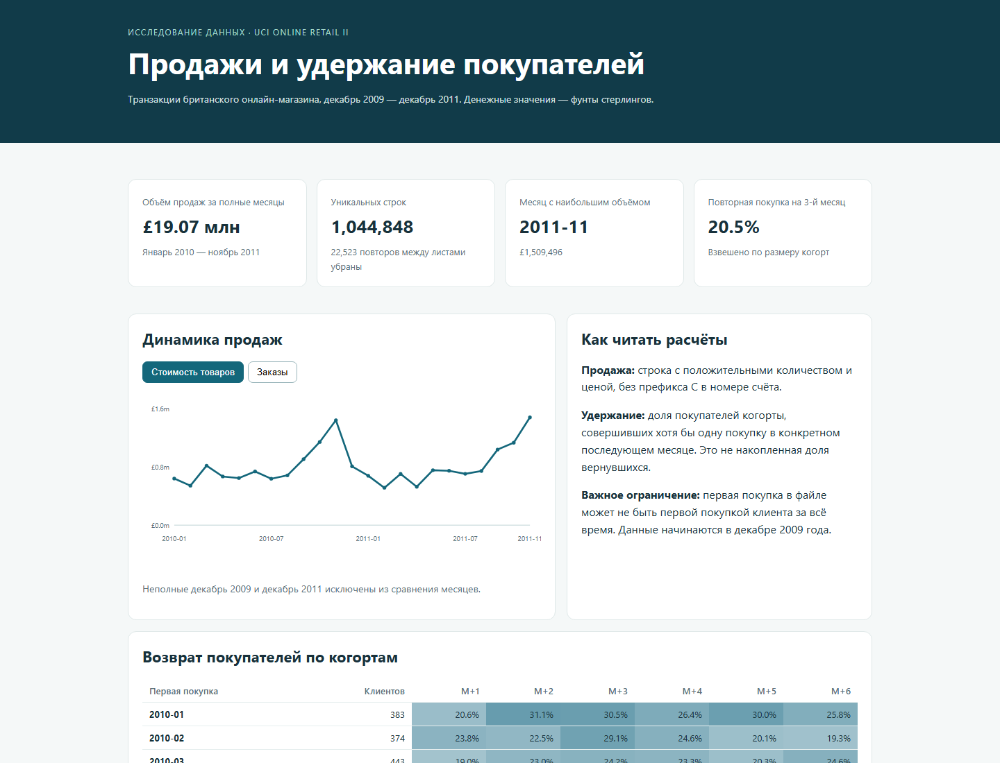

# Продажи и удержание покупателей интернет-магазина

Анализ двух лет транзакций британского интернет-магазина из набора [Online Retail II](https://archive.ics.uci.edu/dataset/502/online+retail+ii). Цель — понять, как менялся объём продаж и насколько часто покупатели возвращались после первого наблюдаемого заказа.

**[Открыть отчёт](https://morenoler.github.io/retail-sales-retention/)** · [Помесячные показатели](output/monthly.csv) · [Когорты](output/cohorts.csv) · [SQL-запросы](sql/analysis.sql)




## Что получилось

- За 23 полных месяца с января 2010 по ноябрь 2011 стоимость проданных товаров составила **£19,07 млн**. Это сумма положительных строк продаж, а не выручка после возвратов или прибыль.
- Самый высокий месяц в наблюдаемом периоде — **ноябрь 2011: £1,51 млн** и 2 769 заказов. Ноябрь 2010 близок по объёму: £1,47 млн.
- Через три месяца после первой наблюдаемой покупки в конкретном месяце снова покупали **20,5%** клиентов. Показатель взвешен по размеру когорт с полным шестимесячным окном наблюдения. Это не доля всех клиентов, когда-либо вернувшихся.
- Основной рынок — **Великобритания**: £17,47 млн стоимости товаров по всему доступному периоду. Сравнивать страны по рентабельности по этим данным нельзя: себестоимости в наборе нет.

График показывает заметные пики осенью в обоих годах. Для планирования закупок я бы сначала проверил, какие товарные группы формируют этот рост, а затем посмотрел на повторные заказы их покупателей. В наборе нет данных о каналах привлечения, поэтому связать удержание с рекламными расходами не получится.

## Важное решение при подготовке данных

Исходная книга содержит два листа. Их периоды перекрываются с 1 по 9 декабря 2010 года: **22 523 строки полностью совпадают**. Перед анализом я оставил эти строки только из первого листа. Поэтому из 1 067 371 строк книги в расчётах участвуют 1 044 848 уникальных строк. Без этого шага декабрь 2010 оказался бы завышен.

Кроме того:

- отменённые счета определяются по префиксу `C` в `Invoice`; строки с неположительным количеством или ценой не считаются продажами;
- 235 287 строк без `Customer ID` остаются в расчёте стоимости продаж, но не участвуют в анализе удержания;
- декабрь 2009 и декабрь 2011 неполные, поэтому не входят в график сравнения месяцев;
- «первая покупка» означает первую покупку *в доступном файле*, а не обязательно первую за всё время существования магазина;
- суммы по отменам вынесены отдельно: файл не даёт надёжно связать каждую отмену с исходной строкой заказа.

Определения показателей и запросы находятся в [`sql/analysis.sql`](sql/analysis.sql). Когорта — покупатели с первой наблюдаемой положительной покупкой в одном месяце. Удержание М+N — доля покупателей когорты, сделавших хотя бы один заказ ровно через N месяцев. Для тепловой карты взяты только когорты, у которых полностью видны следующие шесть месяцев.

## Как воспроизвести

Требуется Python 3.10+.

1. Скачайте `online_retail_II.xlsx` с [страницы UCI](https://archive.ics.uci.edu/dataset/502/online+retail+ii). Если файл скачался как ZIP, сохраните его как `data/raw/online_retail_ii.zip`. Если скачался как XLSX, упакуйте этот файл в ZIP с тем же именем. Внутри архива имя должно быть `online_retail_II.xlsx`.
2. Установите зависимость: `python -m pip install -r requirements.txt`.
3. Выполните `python src/build_db.py` — загрузка Excel в `data/retail.sqlite` занимает несколько минут.
4. Выполните `python src/make_report.py` и откройте `output/dashboard.html` в браузере. Та же страница записывается в `docs/index.html` для GitHub Pages. Отчёт работает без сервера и внешних JS-библиотек.

Скрипт также записывает CSV с помесячными показателями, когортами, странами и отменами. Исходный Excel и SQLite-база не добавляются в Git: они восстанавливаются приведёнными командами.

## Структура

```text
src/build_db.py       Загрузка обоих листов Excel в SQLite
sql/analysis.sql      Определения продаж, когорт и основные SQL-запросы
src/make_report.py    Расчёт таблиц и создание HTML-отчёта
output/               Готовый отчёт, CSV и превью
```

**Источник и лицензия данных:** Daqing Chen, *Online Retail II*, UCI Machine Learning Repository, 2012, [DOI: 10.24432/C5CG6D](https://doi.org/10.24432/C5CG6D). Данные доступны по лицензии [CC BY 4.0](https://creativecommons.org/licenses/by/4.0/).
